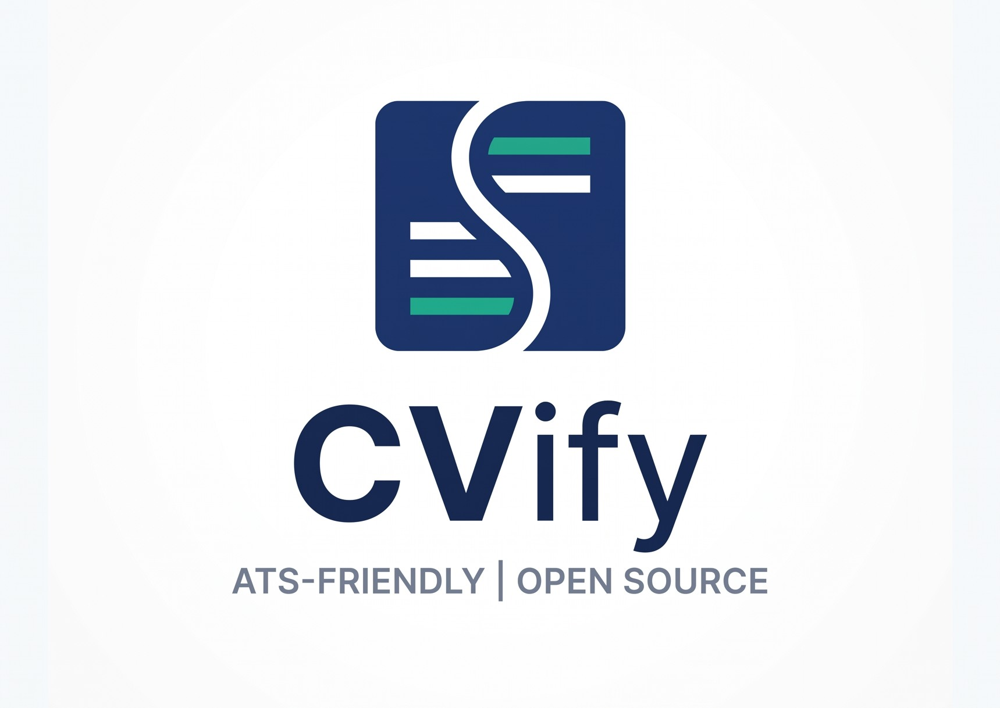

<div align="center">
  
  <h1>CVify</h1>
  <p>An ATS-friendly Resume/CV Builder | Creador de Curriculums optimizado para ATS</p>
  
  [](https://vercel.com/new/clone?repository-url=https%3A%2F%2Fgithub.com%2Fyour-repo%2Fcv-builder)
</div>

---

*[Read in English](#english) | [Leer en Español](#español)*

---

<h2 id="english">English</h2>

**CVify** is an open-source, ATS-friendly Resume/CV Builder built with Next.js and Tailwind CSS. It features a side-by-side live editor and print preview, ensuring that your resume is optimized for both human reading and Applicant Tracking Systems (ATS).

### 🚀 Features

- **Live Print Preview**: See exactly what your printed/PDF resume will look like as you type.
- **Multiple ATS-Friendly Layouts**: Choose between Classic, Modern, or Structured (two-column) designs. Powered by CSS without altering the DOM order, ensuring perfect ATS parsing.
- **ATS-Simulator**: Ensure your resume parses well with Applicant Tracking Systems.
- **Photo Cropper**: Easily upload and adjust a professional photo.
- **Profile Manager**: Save and manage different resume profiles.
- **Privacy-First**: Your data is handled locally.
- **Export to PDF**: Generate a high-quality, perfectly formatted PDF.
- **Open Source**: Feel free to contribute and improve the project!
- **Easy Deployment**: Ready to be deployed on Vercel with a single click.

### 🛠️ Tech Stack

- **Framework**: [Next.js](https://nextjs.org/)
- **UI Library**: [React](https://react.dev/)
- **Styling**: [Tailwind CSS v4](https://tailwindcss.com/)
- **Components**: [shadcn/ui](https://ui.shadcn.com/)
- **Icons**: [Lucide React](https://lucide.dev/)

### 💻 Getting Started

1. **Install dependencies:**
   ```bash
   npm install
   # or
   pnpm install
   # or
   yarn install
   ```

2. **Run the development server:**
   ```bash
   npm run dev
   # or
   pnpm dev
   ```

3. Open [http://localhost:3000](http://localhost:3000) with your browser to see the result.

### 🤝 Contributing

This project is Open Source! We welcome contributions. Whether it's fixing bugs, adding new features, or improving documentation, feel free to open a Pull Request.
1. Fork the project.
2. Create your feature branch (`git checkout -b feature/AmazingFeature`).
3. Commit your changes (`git commit -m 'Add some AmazingFeature'`).
4. Push to the branch (`git push origin feature/AmazingFeature`).
5. Open a Pull Request.

---

<h2 id="español">Español</h2>

**CVify** es un creador de currículums de código abierto (Open Source) optimizado para sistemas ATS, construido con Next.js y Tailwind CSS. Cuenta con un editor en vivo y vista previa de impresión en paralelo, asegurando que tu currículum esté optimizado tanto para lectura humana como para los Sistemas de Seguimiento de Candidatos (ATS).

### 🚀 Características

- **Vista previa en vivo**: Mira exactamente cómo se verá tu currículum en PDF/impreso mientras escribes.
- **Múltiples Plantillas ATS-Friendly**: Elige entre un diseño Clásico, Moderno o Estructurado (dos columnas). Funcionan puramente con CSS manteniendo el orden HTML secuencial, garantizando lectura perfecta por cualquier ATS.
- **Simulador ATS**: Asegúrate de que tu currículum sea analizado correctamente por los sistemas ATS.
- **Recortador de fotos**: Sube y ajusta fácilmente una foto profesional.
- **Gestor de perfiles**: Guarda y administra diferentes perfiles de currículum.
- **Privacidad ante todo**: Tus datos se manejan de forma local.
- **Exportar a PDF**: Genera un PDF de alta calidad y con formato perfecto.
- **Open Source**: ¡Siéntete libre de contribuir y mejorar el proyecto!
- **Fácil Despliegue**: Listo para ser desplegado en Vercel con un solo clic.

### 🛠️ Tecnologías

- **Framework**: [Next.js](https://nextjs.org/)
- **Librería UI**: [React](https://react.dev/)
- **Estilos**: [Tailwind CSS v4](https://tailwindcss.com/)
- **Componentes**: [shadcn/ui](https://ui.shadcn.com/)
- **Iconos**: [Lucide React](https://lucide.dev/)

### 💻 Primeros Pasos

1. **Instalar las dependencias:**
   ```bash
   npm install
   # o
   pnpm install
   # o
   yarn install
   ```

2. **Iniciar el servidor de desarrollo:**
   ```bash
   npm run dev
   # o
   pnpm dev
   ```

3. Abre [http://localhost:3000](http://localhost:3000) en tu navegador para ver el resultado.

### 🤝 Cómo Contribuir

¡Este proyecto es Open Source! Agradecemos cualquier contribución. Ya sea corrigiendo errores, añadiendo nuevas funcionalidades o mejorando la documentación, siéntete libre de abrir un Pull Request.
1. Haz un Fork del proyecto.
2. Crea tu rama de funcionalidad (`git checkout -b feature/NuevaCaracteristica`).
3. Haz commit de tus cambios (`git commit -m 'Añadir NuevaCaracteristica'`).
4. Sube la rama (`git push origin feature/NuevaCaracteristica`).
5. Abre un Pull Request.

---

### License / Licencia

This project is licensed under the MIT License. / Este proyecto está bajo la Licencia MIT.
